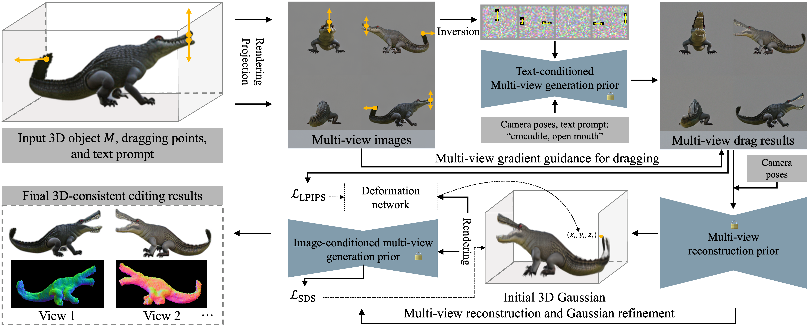

<h1>
MvDrag3D: Drag-based Creative 3D Editing via Multi-view Generation-Reconstruction Priors
</h1>

<a href="https://chenhonghua.github.io/clay.github.io/">Honghua Chen, </a>

<a href="https://nirvanalan.github.io/">Yushi Lan, </a>

<a href="https://cyw-3d.github.io/">Yongwei Chen, </a>

<a href="https://zhouyifan.net/">Yifan Zhou, </a>

<a href="https://xingangpan.github.io/">Xingang Pan</a>

S-Lab, Nanyang Technological University, Singapore

    

    <b>MVDrag3D</b> provides a precise, generative, and flexible solution for 3D drag-based editing, 
    supporting more versatile editing effects across various object categories and 3D representations.
    

<h2 class="title is-3">Abstract</h2>

    

    Drag-based editing has become popular in 2D content creation, driven by the capabilities of image generative models. However, extending this technique to 3D remains a challenge. 
    Existing 3D drag-based editing methods, whether employing explicit spatial transformations or relying on implicit latent optimization within limited-capacity 3D generative models, 
    fall short in handling significant topology changes or generating new textures across diverse object categories. 
    To overcome these limitations, we introduce MVDrag3D, a novel framework for more flexible and creative drag-based 3D editing that leverages multi-view generation and reconstruction priors.
    At the core of our approach is the usage of a multi-view diffusion model as a strong generative prior to perform consistent drag editing over multiple rendered views, which is followed by a reconstruction model that reconstructs 3D Gaussians of the edited object.
    While the initial 3D Gaussians may suffer from misalignment between different views, we address this via view-specific deformation networks that adjust the position of Gaussians to be well aligned.
    In addition, we propose a multi-view score function that distills generative priors from multiple views to further enhance the view consistency and visual quality. Extensive experiments demonstrate that MVDrag3D provides a precise, generative, and flexible solution for 3D drag-based editing, supporting more versatile editing effects across various object categories and 3D representations.
    

<h2 class="title is-3">Pipeline</h2>

    <strong>The overall architecture of MVDrag3D.</strong>
    Given a 3D model and multiple pairs of 3D dragging points, we first render the model into four orthogonal views, each with corresponding projected dragging points. 
    Then, to ensure consistent dragging across these views, we define a multi-view guidance energy within a multi-view diffusion model. 
    The resulting dragged images are used to regress an initial set of 3D Gaussians. 
    Our method further employs a two-stage optimization process: first, a deformation network adjusts the positions of the Gaussians for improved geometric alignment, 
    followed by image-conditioned multi-view score distillation to enhance the visual quality of the final output.

<section class="section" id="BibTeX">

    <h2 class="title">BibTeX</h2>
    <pre><code>
@inproceedings{chen2024mvdrag3d,
title={MVDrag3D: Drag-based Creative 3D Editing via Multi-view Generation-Reconstruction Priors}, 
author={Honghua Chen and Yushi Lan and Yongwei Chen and Yifan Zhou and Xingang Pan},
year={2024},
booktitle={arxiv},
}</code></pre>

</section>